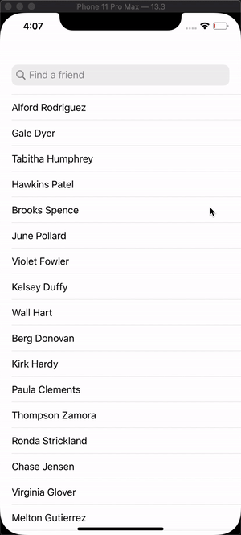

# FriendFace

_Description_

Friendface: a simple social media app that downloads friends from a server and shows some information about them.


# App Demo




Concepts used here in this project.
------------------------------------------------

- Implement Search Bar
```swift
class ViewController: UITableViewController, UISearchResultsUpdating {
    let dataSource = FriendDataSource()

    override func viewDidLoad() {
        super.viewDidLoad()

        dataSource.dataChanged = { [weak self] in
            self?.tableView.reloadData()
        }

        dataSource.fetch("https://www.hackingwithswift.com/samples/friendface.json")
        tableView.dataSource = dataSource

        let search = UISearchController(searchResultsController: nil)
        search.searchResultsUpdater = self
        search.obscuresBackgroundDuringPresentation = false
        search.searchBar.placeholder = "Find a friend"
        navigationItem.searchController = search
    }

    func updateSearchResults(for searchController: UISearchController) {
        dataSource.filterText = searchController.searchBar.text
    }

}
```

- Make DataStore handle the data
```swift
var filterText: String? {
        didSet {
            filteredFriends = friends.matching(filterText)
            dataChanged?()
        }
    }

    func fetch(_ urlString: String) {
        let decoder = JSONDecoder()
        decoder.dateDecodingStrategy = .iso8601

        decoder.decode([Friend].self, fromURL: urlString) { friends in
            self.friends = friends
            self.filteredFriends = friends
            self.dataChanged?()
        }
    }
```

